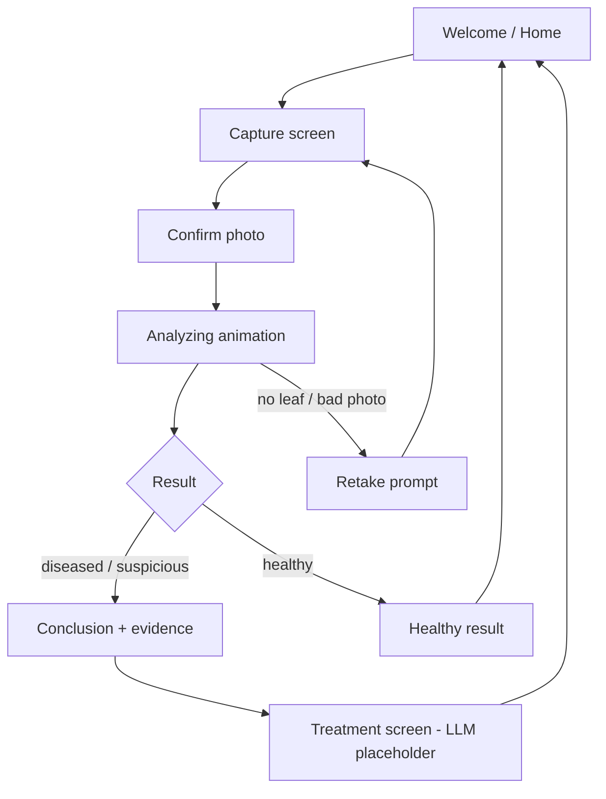

# PhytoLabs — Design Handoff

Handoff for Figma / app UI-UX design. Covers what's built in the ML pipeline, the data the app will display, and a screen-by-screen UX spec.

---

## 1. What the product is

PhytoLabs detects **wheat brown/leaf rust** (*Puccinia triticina*) from a photo of a single leaf, and does three things — its three pillars:

1. **Detect** — is the leaf diseased?
2. **Evidence** — show *why* (highlight the lesions, quantify them, grade severity).
3. **Treatment** — recommend what to do (this screen is a placeholder now; an LLM will fill it in later).

**Scope constraint that shapes the capture UX:** the model works on **clean, close-up photos of one leaf** (ideally plain/dark background). Field photos with soil in frame degrade accuracy. The capture screen should gently guide the user toward a good shot.

---

## 2. What's already built (backend / ML)

A working two-stage classical-ML pipeline, validated at **94% accuracy / 1.00 precision / 0.87 recall** on held-out leaves:

- **Stage 1 — GMM segmentation (HSV):** segments the leaf and finds rust-colored lesions, producing a **lesion overlay image** (the leaf with lesions highlighted in red) — this is the hero visual for the results screen.
- **Stage 2 — Logistic regression + SGD (from scratch in NumPy):** outputs a **probability** the leaf has rust, bucketed into healthy / suspicious / diseased.
- **Severity grade:** percent of leaf area covered by lesions, mapped to `none / mild / moderate / severe` (modified Cobb scale; computed from segmentation, independent of the classifier).

The pipeline runs end-to-end today (CLI + Colab). The mobile app will call this as an API: user photo → backend inference → JSON + overlay image back.

**Dataset:** Mendeley "Wheat nitrogen deficiency and leaf rust" (Leaf rust subset); Otsu-masked, black-background close-ups. Not in the repo — loaded from Google Drive in Colab.

**Known weakness:** mild/early infections with tiny lesion area can be missed by the binary classifier (7 false negatives on validation). Severity grading partially compensates by flagging trace lesions even when the verdict is healthy.

---

## 3. The data contract (design around these exact fields)

Every analysis returns:

| Field | Type | Values | UI use |
| --- | --- | --- | --- |
| `label` | string | `healthy` · `suspicious` · `diseased` | Headline verdict |
| `probability` | float 0–1 | e.g. `0.87` | Confidence meter ("87% confident") |
| `severity` | string | `none` · `mild` · `moderate` · `severe` | Severity badge |
| `severity_percent` | float 0–100 | e.g. `9.5` | "9.5% of leaf affected" |
| `features.blob_count` | number | e.g. `38` | "38 lesions detected" |
| `features.lesion_area_fraction` | float | e.g. `0.095` | Same as severity_percent (÷100) |
| overlay image | image | leaf with red-highlighted lesions | Hero result visual |

**Important nuance for the designer:** severity is computed **independently** of the verdict. You can have `label = healthy` but `severity = mild`. The UI should handle: *"Probably healthy, but we found trace lesions — keep an eye on it."* This is a feature, not a bug.

**Suspicious band:** probabilities in 0.45–0.55 map to a third class (`suspicious`) for borderline cases.

**Default severity thresholds (% leaf area with rust):**

| grade | range |
| --- | --- |
| `none` | < 1% |
| `mild` | 1–10% |
| `moderate` | 10–25% |
| `severe` | ≥ 25% |

---

## 4. User flow

**Basic flow (MVP):**

1. User takes photo (or picks from gallery).
2. Model analyzes it — **animation / loading window** with staged progress.
3. **Conclusion screen** — verdict, confidence, severity, evidence (overlay + stats).
4. **Treatment button** → treatment screen (LLM + RAG integrated later; design shell + states now).

---

## 5. Screen-by-screen spec

### Screen 1 — Home / Welcome

- Logo, one-line value prop ("Scan a wheat leaf, get a rust diagnosis").
- Primary CTA: **Scan a leaf** (camera). Secondary: upload from gallery.
- Optional: small "How it works" / history of past scans.

### Screen 2 — Capture

- Live camera with a **framing guide** (centered leaf outline / reticle).
- Inline tips: *"Fill the frame with one leaf · plain background · good light."*
- Capture button + gallery import.
- Designer note: this guidance directly maps to the model's clean-background requirement.

### Screen 3 — Confirm photo

- Show captured image full-width.
- **Retake** / **Analyze** buttons.

### Screen 4 — Analyzing (animation window)

- Processing animation while inference runs (a few seconds on device or API).
- Animate the **actual pipeline steps** as a 3-step progress sequence:
  1. "Isolating the leaf…"
  2. "Detecting lesions…"
  3. "Scoring & grading…"
- Suggested visual: the user's photo with a scanning sweep; lesions "lighting up" as detected.

### Screen 5 — Conclusion / Results (core screen)

Layout top → bottom:

1. **Hero overlay image** — the leaf with lesions highlighted in red (from Stage 1).
2. **Verdict headline** — `Diseased` / `Suspicious` / `Healthy`, color-coded.
3. **Confidence** — e.g. "87% confident" (meter or ring from `probability`).
4. **Severity badge** — e.g. `Mild` + "9.5% of leaf area affected."
5. **Evidence row** — e.g. "38 lesions · 9.5% area" (supporting numbers from features).
6. **Honest-limitation microcopy** when relevant:
   - `suspicious` → "Borderline — consider re-scanning or a closer look."
   - healthy but trace severity → "Likely healthy, but minor spots detected."
7. **Primary CTA: View treatment plan →**

### Screen 6 — Treatment (LLM placeholder)

- **Not built yet.** LLM + RAG will generate guidance later.
- Design now:
  - **Loading / generating state** (LLM may stream).
  - **Result card** with sections: Summary · Recommended actions · Products · When to act.
  - **Disclaimer:** "Guidance only — consult an agronomist."
- Include empty, loading, and error states so the LLM integration drops in cleanly.

---

## 6. Visual system suggestions

Color semantics tied to real grades (consistent across badges, meters, overlays):

| State | Suggested color |
| --- | --- |
| Healthy / `none` | Green |
| `mild` | Yellow |
| `moderate` | Orange |
| `severe` / Diseased | Red |
| `suspicious` | Amber / gray |

- **Tone:** clean, clinical-but-friendly (diagnostic tool for farmers, agronomists, students).
- **Signature visual:** red lesion overlay on the leaf — make it the focal point on the results screen.
- **Typography:** legible outdoors (high contrast, large verdict text).

---

## 7. States & edge cases to design

- **Loading** — analyzing animation; treatment generating (LLM).
- **No leaf detected / poor photo** — friendly retake prompt with tips.
- **Suspicious / borderline** verdict (0.45–0.55 band).
- **Healthy-but-trace** — healthy label + mild severity.
- **Error / offline** — inference or API failed.
- **History / empty** — if scan history is in scope.

---

## 8. Scope reminders for the designer

- One disease only: **brown/leaf rust** — don't imply multi-disease detection in copy.
- Severity is an **estimate** from segmentation ("approx. % leaf affected"), not a lab-validated clinical measurement (no severity ground truth in the dataset).
- Treatment content is **not built** — design the shell and states; LLM fills content later.
- Image-level classification only — overlays are qualitative evidence from unsupervised segmentation, not per-lesion ground truth.

---

## 9. Technical reference (for engineers pairing with design)

| Resource | Location |
| --- | --- |
| GitHub repo | https://github.com/Adian17/PhytoLabs |
| Pipeline entry | `pipeline.predict_image()` → `probability`, `label`, `severity`, `severity_percent`, `features`, + segmentation masks for overlay |
| Severity module | `src/phytolabs/severity.py` |
| Colab demo | `notebooks/colab_phytolabs.ipynb` (Drive zip + full pipeline) |

**Future integration points:**

- `result["severity"]` / `result["severity_percent"]` → results UI + treatment context for LLM.
- Overlay image → generated server-side from `viz.overlay_lesions(bgr, seg["rust"])`.

---

## 10. Out of scope (current MVP)

- Multi-disease detection.
- Field photos with soil/complex backgrounds (without preprocessing).
- Per-region / pixel-accuracy claims.
- Live LLM treatment content (design placeholder only).
